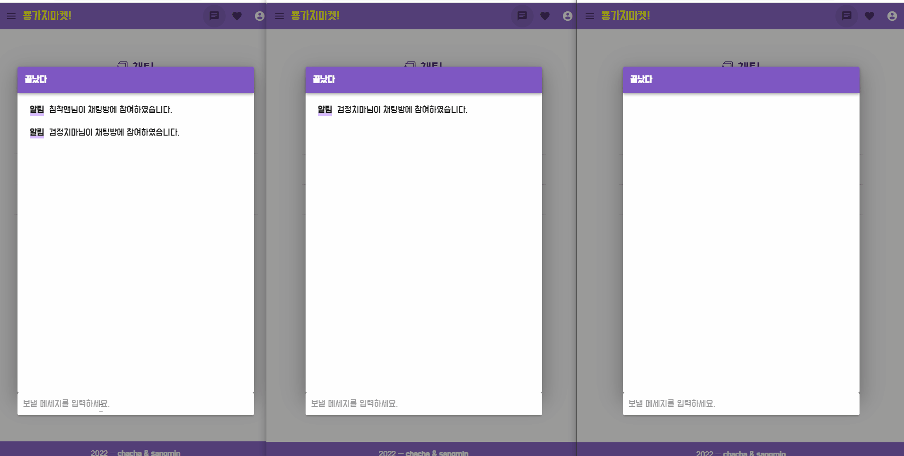

> <h1>SSAFY 8기 1학기 Final Project : 가지마켓 🍆</h1>
> 정상민 차현경

 

> <h2>목표</h2>

- Web Architecture를 이해하고 활용하여 Web Project를 설계하고 구현할 수 있다
- Spring & MyBatis Framework, Spring Boot, Vue.js를 이해하고 활용할 수 있다.
- OAuth 로그인, REST API등의 기술을 활용하여 MSA를 도입해 본다.
- Open Api 활용한 지도, 얼굴인식 서비스 등 추가기능 구현 할 수 있다.
- Web Socket 통신 활용한 채팅 서비스 구현할 수 있다.

> <h2>Technology</h2>

- Vuetify를 적용하여 화면 디자인
- JWT를 활용한 로그인,로그아웃 인증 및 회원정보 관리
- 공공데이터를 활용한 DB 데이터 크롤링
- 아파트 거래내역 검색, 카카오 지도API(지도, 로드뷰, 상권정보) 결과 출력
- 파일첨부, 검색 기능 등을 포함한 게시판
- 네이버 Clova Face Recognition Open Api 활용한 얼굴인식 서비스
- 네이버 검색 API 활용 닮은꼴 검색 결과 이미지 출력
- Web Socket 통신 활용한 채팅 서비스

 

> <h2>구현 기능</h2>

<h3>🔹 메인 화면</h3>

<b>o 기능 설명<b>

1. 페이지 정보, 각종 서비스로 이동할 수 있는 헤더 구성
2. 서비스의 설명과 대략적인 데이터를 볼 수 있는 메인 페이지 구성

<b>o 구현 방법</b>

1. Vue을 활용한 Single Page Application 구성
2. Vuetify를 적용한 디자인
3. 회원정보, 공지사항, 최근 거래내역 SpringBoot Rest 비동기 통신
4. Vue Router 활용 메인페이지, 로그인, 아파트, 게시판, 채팅 기능 별 Componet 설계

<b>o 결과 화면</b>

 

<h3>🔹 회원관리 & 얼굴인식</h3>

<b>o 기능 설명<b>

1. 회원 인증, 토큰 관리
2. 회원가입, 로그인, 로그아웃, 정보 수정 기능 포함한 회원 관리
3. 닮은꼴, 추정나이, 추정성별 등 데이터 활용한 이미지 프로필 관리

<b>o 구현 방법</b>

1. JSON Web Token활용 회원 인증
2. Vuex 활용 데이터 관리, Vue Router 활용 로그인, 회원가입 등 기능별 Component 설계
3. 네이버 Clova Face Recognition Open Api에 얼굴이미지 파일 전송 후 프로필 데이터 획득. 이를 통한 회원 프로필 관리

<b>o 결과 화면</b>

 

<h3>🔹 집가지마켓</h3>

<b>o 기능 설명<b>

1. 아파트 거래내역 검색, 상세정보 보기
2. 지도를 활용한 아파트 정보 출력
3. 회원 인증 시 아파트 북마크 등록

<b>o 구현 방법</b>

1. SpringBoot Rest 비동기 통신 활용 아파트 거래내역 검색, 시도/군구/동/거래년월 입력
2. Vuex 활용 데이터 관리, Vue Router 활용 아파트 검색, 상세보기, 북마크 관리 등 기능별 Component 설계
3. 카카오 지도 Open Api 활용 검색 결과를 일반지도, 로드뷰, 주변상권지도 통한 출력 및 상세보기 서비스 제공
4. 회원인증 시 북마크 등록 기능제공하여 회원 별 관심지역 관리

<b>o 결과화면</b>

 

<h3>🔹 바가지마켓</h3>

<b>o 기능 설명<b>

1. Paging 처리 활용한 게시판 목록 페이지 설계
2. 사진 첨부 기능 활용한 게시글 작성, 게시글 별 판매중/예약중/판매완료 상태적용
3. 카테고리(전체, 판매, 구매, 소통), 최신순/추천순/조회순, 작성자/글이름 별 검색 및 조회 기능
4. 댓글 작성, 좋아요 기능 포함한 게시글 상세보기
5. 댓글, 게시글 작성자 프로필 사진 출력

<b>o 구현 방법</b>

1.  Vuex 활용 데이터 관리, Vue Router 활용 게시글 목록, 상세보기, 게시글 작성 등 기능별 Component 설계
2.  Multipart/form-data 활용 이미지 파일 첨부 및 DB 관리
3.  Mybatis 활용 Mysql 통한 검색 및 정렬 기능 구현

<b>o 결과화면</b>

 

<h3>🔹 채팅</h3>

<b>o 기능 설명<b>

1. 채팅방 목록, 오픈 채팅방 생성 기능
2. 채팅방 입장 및 채팅 서비스 이용

<b>o 구현 방법</b>

1.  WebSoket활용한 서버-클라이언트 간 양방향 통신, 채팅방 입장이 소켓 연결을 뜻함
2.  채팅방 마다 각각 다른 세션 연결 관리
3.  SockJS, STOMP 활용 브라우저 제한 해소 및 Socket 메시지 관리

<b>o 결과화면</b>

  

> <h2>DB Diagram</h2>

